# WAPH-Web Application Programming and Hacking

## Instructor: Dr. Phu Phung

# Lab 1 - Foundations of the Web 

## Overview 

This lab introduced the foundational concepts of web communication and basic server-side programming. Part I focused on analyzing HTTP traffic using Wireshark and Telnet. Part II covered CGI web applications in C and PHP, along with understanding HTTP GET and POST requests. These exercises provided insights into how web requests are formed, processed, and responded to on the server.

GitHub folder: [https://github.com/prabhupv/waph-prabhupv/tree/main/labs/lab1](https://github.com/prabhupv/waph-prabhupv/tree/main/labs/lab1)

## Part I - The Web and HTTP Protocol

### Task 1. Familiar with the Wireshark tool and HTTP protocol

Wireshark was used to capture packets from web traffic generated through browsing and manual HTTP requests. We applied an HTTP filter and inspected the structure of HTTP requests and responses. 

- Screenshot 1: HTTP Request message  
  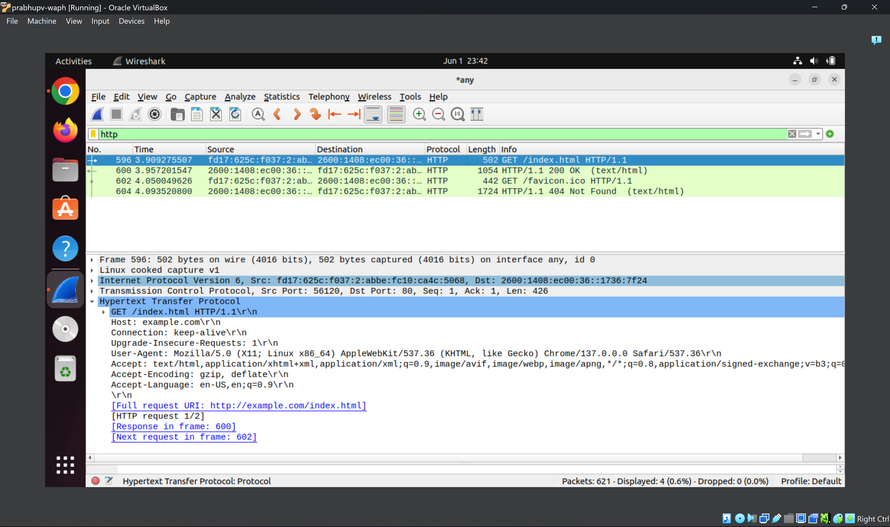  
  *Figure: HTTP GET request in Wireshark*

- Screenshot 2: HTTP Response message  
  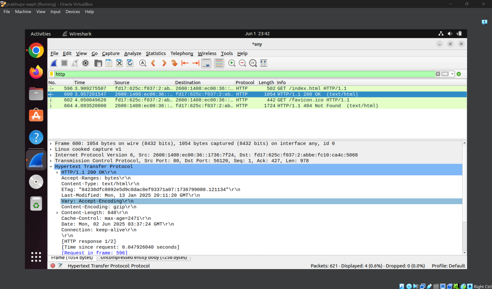  
  *Figure: HTTP response from server*

- Screenshot 3: Full HTTP Stream view  
  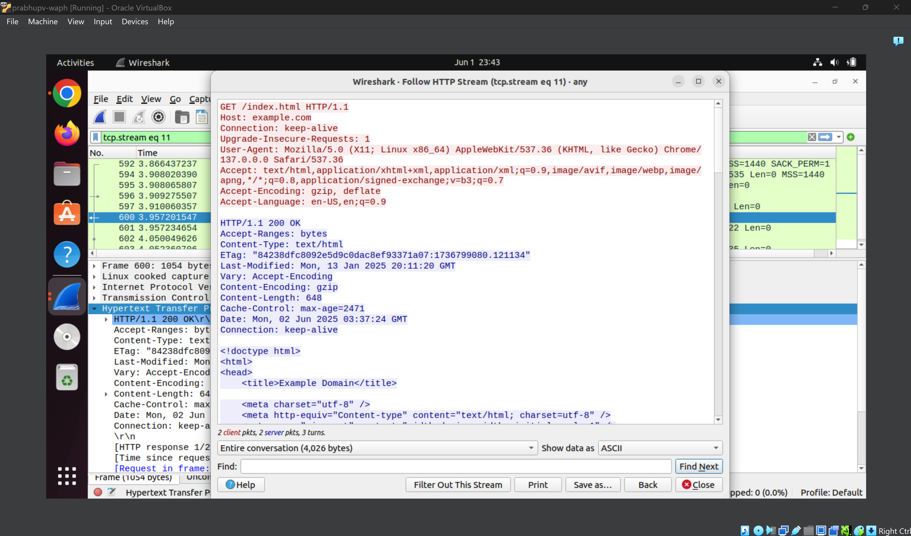  
  *Figure: HTTP stream captured in Wireshark*

### Task 2. Understanding HTTP using telnet and Wireshark

Telnet was used to send a minimal HTTP request to example.com:
```
telnet example.com 80
GET /index.html HTTP/1.0
Host: example.com
```

Wireshark captured the request and response. Compared to browser requests, the telnet version lacked headers like `User-Agent` and `Accept`. Responses were otherwise similar.

- Screenshot 4: Terminal with HTTP request/response  
  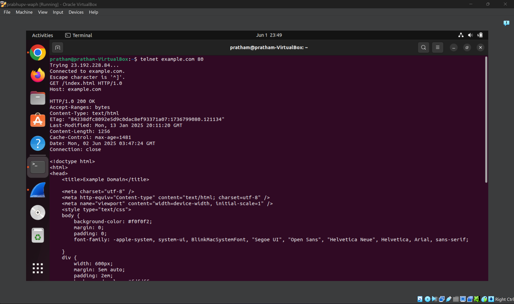  
  *Figure: HTTP exchange using telnet*

## Part II - Basic Web Application Programming

### Task 1. (10 pts) CGI Web applications in C

a. A simple Hello World CGI was written in C and compiled to an executable placed in `/usr/lib/cgi-bin`. Apache’s `cgid` module was enabled for this.

- Screenshot: Browser rendering the Hello World CGI  
    
  *Figure: Hello World CGI in browser*

b. A second C program was created to output a full HTML document with headings and paragraphs.

Included file `index.c`:
```c
#include <stdio.h>
int main(void) {
    printf("Content-Type: text/html\n\n");
    printf("<!DOCTYPE html><html><head><title>Lab 1</title></head>");
    printf("<body><h1>Hello from Pratham</h1><p>This is a simple HTML page from a CGI C program.</p></body></html>");
    return 0;
}
```

- Screenshot: HTML output in browser  
  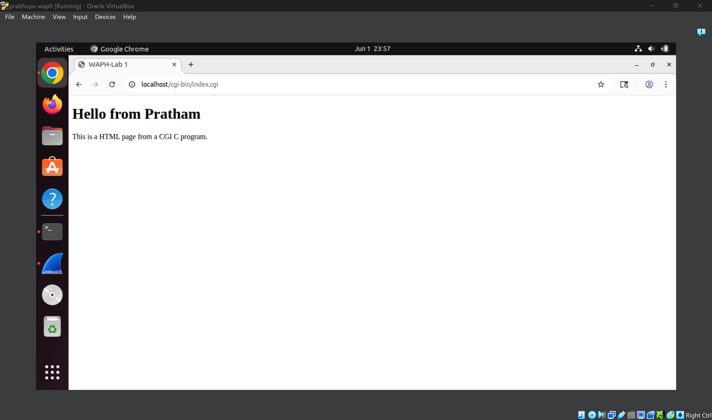  
  *Figure: CGI HTML output*

### Task 2 (10 pts). A simple PHP Web Application with user input.

a. A PHP file `helloworld.php` was created to display a custom message and call `phpinfo()`.

- Screenshot: Hello message + phpinfo()  
  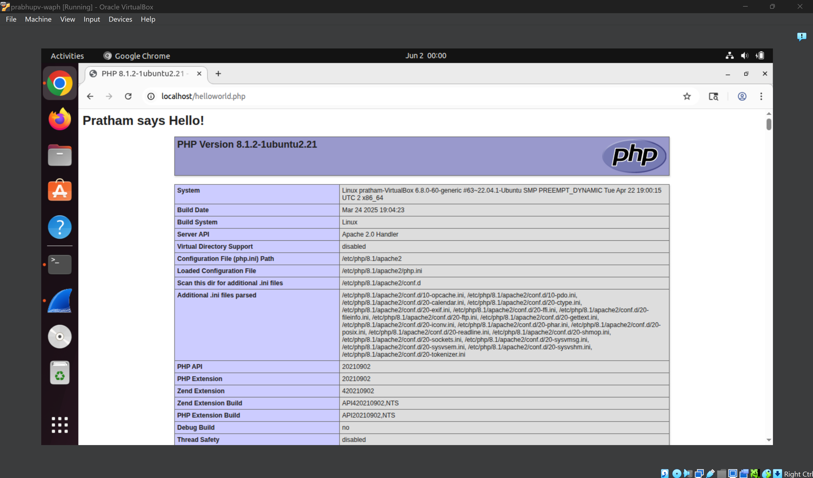  
  *Figure: PHP Hello World with phpinfo output*

b. `echo.php` was created to output user input:
```php
<?php
echo "Echoed data: " . $_REQUEST["data"];
?>
```
- Screenshot 1: Browser with GET request output  
  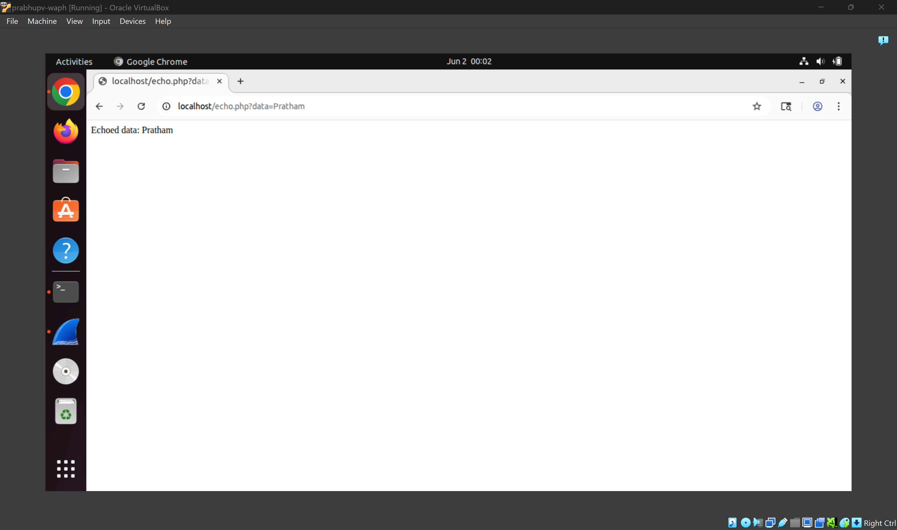  
  *Figure: echo.php with GET request*

- Screenshot 2: curl terminal with POST request  
  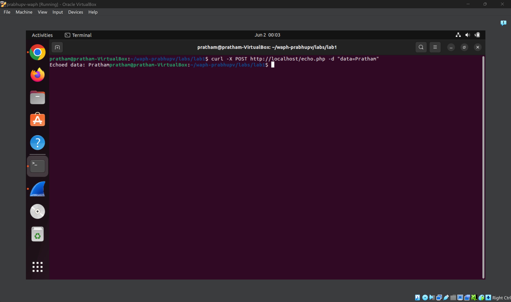  
  *Figure: echo.php with POST request using curl*

**Security risk:** The app echoes raw input, allowing potential XSS attacks. For example:
```
echo.php?data=<script>alert('XSS')</script>
```
To prevent this, use:
```php
echo htmlspecialchars($_REQUEST["data"]);
```

### Task 3 (10 pts). Understanding HTTP GET and POST requests.

a. Wireshark captured GET request to `echo.php` with data in the URL.
- Screenshot 1: GET request in Wireshark  
  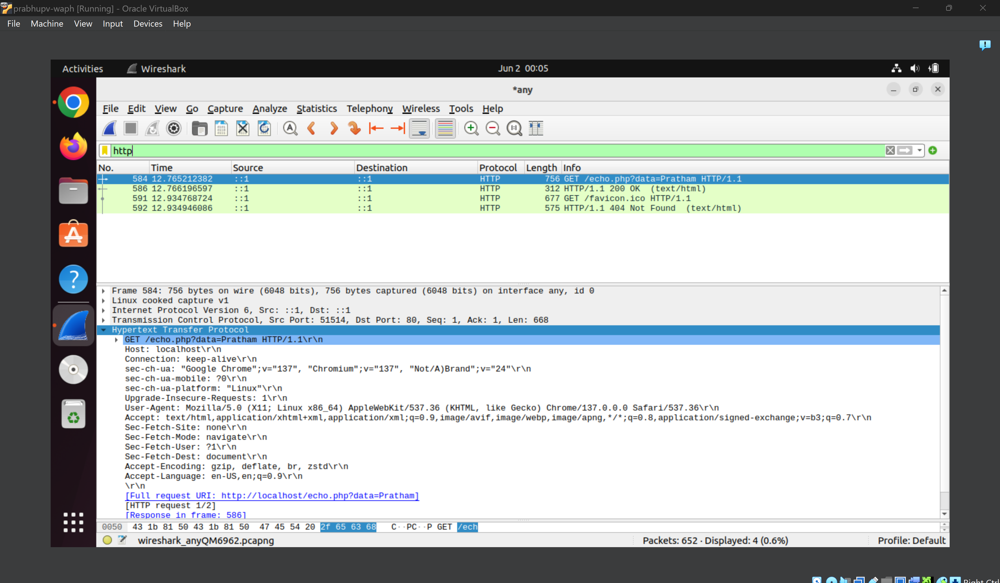  
  *Figure: GET request packet*

- Screenshot 2: GET response  
  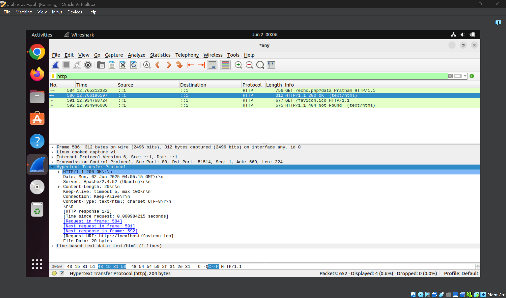  
  *Figure: Response to GET*

b. curl was used for a POST request:
```bash
curl -X POST http://localhost/echo.php -d "data=Pratham"
```
- Screenshot 1: curl output  
  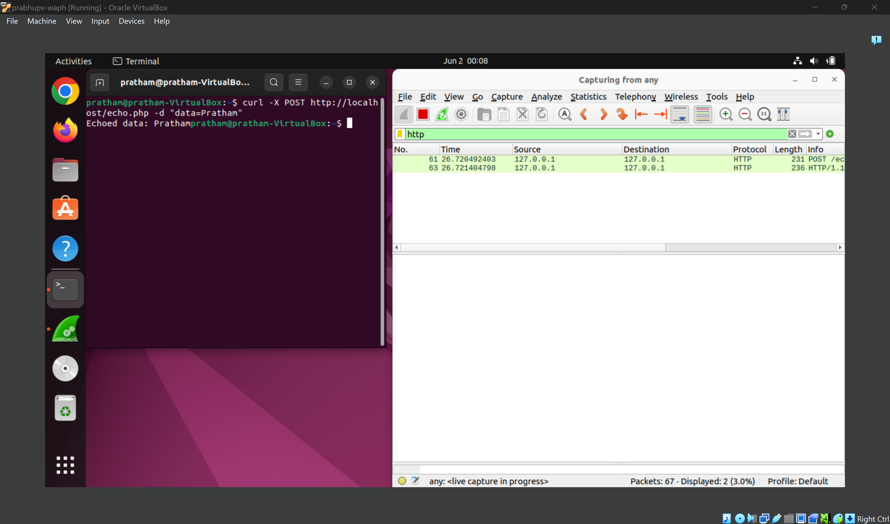  
  *Figure: curl POST output*

- Screenshot 2: POST stream in Wireshark  
  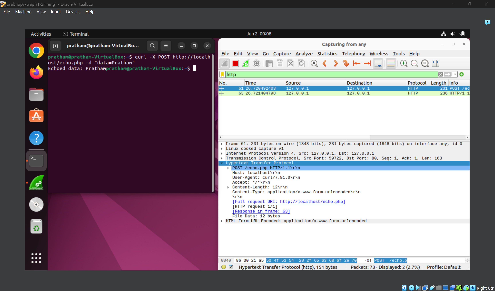  
  *Figure: POST request in Wireshark*

c. **Comparison:**
- GET: Data in URL, visible, bookmarkable, limited size.
- POST: Data in body, hidden from URL, better for forms.
- Responses were similar, but the request structure differs.

## Submission